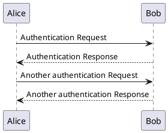

+++
title = "Ditch WYSIWYG apps and switch to plaintext tools"
author = ["Benoit Joly"]
date = 2020-07-31
lastmod = 2020-12-18T00:42:14-05:00
tags = ["coding", "plaintext", "opinion", "100DaysToOffload"]
categories = ["tech"]
draft = false
+++

On this post, I'll go over WYSIWYG apps, and effective alternatives.

Like it or not, in tech jobs, we have to write documentation and create diagrams to share our ideas and solutions.

The traditional approach is to use WYSIWYG (what you see is what you get) apps. The approach with WYSIWYG apps is to allow you to edit the graphical representation of your document. This is now mainstream in spreadsheet apps, word processors, presentation apps, and diagram tools. Using MS tools, it's word, excel, PowerPoint, vision, or the equivalent LibreOffice writer, calc, impress. These apps use more or less open formats, at the same time have you ever tried to understand one? These formats are made for software, not for humans.

The older of us may remember at a time, WYSIWYG views were non existent and then became an addon feature (Anyone remembers Lotus 1-2-3?). We had the sense of progress!!! We still had stuff like sgml documents around, but for a while, plaintext documents almost disappeared.

## Anti-productivity {#anti-productivity}

### Portability {#portability}

Going from one format to another is kind of difficult.

### Collaboration {#collaboration}

Collaborating on one ppt or docx document is kind of a nightmare. Same goes with LibreOffice equivalent.

This one evolved over time, we now have web applications to do this. Even if this is working, we end up with centralized services that cannot work offline.

### Version control {#version-control}

Difficult to implement of a complex file format with graphical tools.

### Structure and data mixed with presentation {#structure-and-data-mixed-with-presentation}

Reason why we have CSS and HTML, separation of concerns. For diagram tools, you also have physical position to handle as well.

Have you ever tried to build a diagram live during a session with a client? This may prove to be quite stressful and unproductive. The "oh, can you add a box there, shift this lower, can you make all the boxes red, etc..." are becoming quite complex to perform.

There is also maintenance of these documents, not too difficult when we just created them, but quite painful.

## Alternatives {#alternatives}

**Plaintext** is one of the best alternative to what we are used to. We can share, read, modify with our text editor, version control in git, collaborate, easily write/modify them during live sessions.

I've been transitioning to plaintext format for couple of years now, use git to share and control changes.

Here are some known and less known alternatives to WYSIWYG apps:

### work processors {#work-processors}

This is the easiest of the bunch, many of us probably use an alternative to word or writer:

1.  [markdown](https://daringfireball.net/projects/markdown/) :: possibly the most popular of the gang. quite good for simple stuff. No specifications means 100 variants. Good for READMEs, short docs.
2.  [commonmark](https://commonmark.org/) :: a tentative to create a markdown specification. Not sure how successful this is. Use in same context as markdown
3.  [asciidoc](https://asciidoctor.org/) :: a simpler markup facade to docbook, a full fledged document standard created by oasis. This one is quite good for writing more complex documents. It both replaces word/writer and is an alternative to LaTex.
4.  [org-mode](https://orgmode.org/) :: mostly Emacs specific, can be used as both a markdown replacement, as well as an outliner / task list / note taking app.

Honorable mentions:

1.  [LaTex](https://www.latex-project.org/) :: I never really used it, but some love it and it has similar properties than other plaintext formats. The showstopper for me is the higher barrier of entry / learning curve.
2.  [reStructuredText](https://docutils.sourceforge.io/rst.html) :: seems similar than others. Haven't tried because it is similar to other more popular formats.

### Spreadsheet {#spreadsheet}

This area is still dominated by Excel and Calc. I usually take CVS data feeds which address part of the issues with Excel / Calc. This is an areas I haven't experimented too much.

Honorable mentions:

1.  [org-mode](https://orgmode.org/) :: offers simple aggregation functions for simple spreadsheet in org tables.
2.  gnuplot :: can be used to replace graphs
3.  sc :: ncurses TUI spreadsheet. This one feels like Lotus 1-2-3 :). It is now discontinued. I barely used it, but it seemed fined.

### Presentation {#presentation}

Like word processors, many of us use plaintext alternatives.

The one I've used

1.  [org-reveal](https://github.com/yjwen/org-reveal) :: org-mode + reveal.js. my today's favorite setup
2.  org-mode w/ [LaTex Beamer](https://github.com/josephwright/beamer) :: when I need to share my org-mode presentations

Honorable mentions:

1.  [LaTex Beamer](https://github.com/josephwright/beamer) :: often seen in scholar's presentations.
2.  [Sent](https://tools.suckless.org/sent/) :: extra minimalist presentation software inspired by the Takahashi technique

### Diagrams {#diagrams}

These tools are ones I use almost daily. I work with relatively large teams, and have to share ideas with coders, business analyst, clients, and many more.

Some people are listeners, some are visual. I then to create diagrams that has both text and visual elements.

How does it work for diagrams?

You "code" your diagram like here in this flowchart:



Here are some of the tools I use:

1.  [plantuml](https://plantuml.com/) :: my goto tool for diagrams, don't be fooled by the UML in it's name, it's not like most UML tools that enforce strict UML rules. In many ways, it's main role is to put boxes with text/icons in a graph and link them when related. In follow-up posts, I will cover some of the diagrams you can create.
2.  [mermaid](https://mermaid-js.github.io/mermaid/#/) :: Similar to plantuml, but in JavaScript. I've used mermaid-cli to create git branching diagrams
3.  [graphviz](https://graphviz.org/) :: when the other 2 tools don't give want I want. Really flexible. Plantuml uses graphviz as a backend.
4.  [nwdiag](http://blockdiag.com/en/nwdiag/index.html) :: build network diagrams

Honorable mentions:

1.  [Ditaa](http://ditaa.sourceforge.net/) :: draw ASCII boxes and it renders them in an image
2.  [rackdiag/nwdiag](http://blockdiag.com/en/nwdiag/index.html) :: build a server rack diagram
3.  [erd](https://github.com/BurntSushi/erd) :: entity relation diagrams
4.  imagemagik convert / identify :: add text to images
5.  banner / cowsay :: generate plain text art and banners
6.  [shaape](https://github.com/christiangoltz/shaape) :: ascii art to image converter
7.  [syntrax](https://kevinpt.github.io/syntrax/) :: railroad diagrams. could be used for branching diagrams. next one on my list

Most of these diagrams can be embedded in markdown, asciidoc and org-mode files including presentations.

Some references for diagram tools:

1.  [diagram.md](https://gist.github.com/blackcater/1701e845a963216541591106c1bb9d3b)
2.  [asciidoctor](https://asciidoctor.org/docs/asciidoctor-diagram/)
3.  [org-babel languages](https://orgmode.org/worg/org-contrib/babel/languages.html)

## Thoughts {#thoughts}

I just could barely touch the subject but this is already too long. I hope I could give you some ideas and alternatives to tools most people use.

While doing this post, I discovered some cool tools I did not know. This may be useful for some of my work related documents. You may see more post around this in the future.

---

_This is day 12 of my #100DaysToOffload. You can read more about the challenge here: <https://100daystooffload.com>._

<!--more-->
